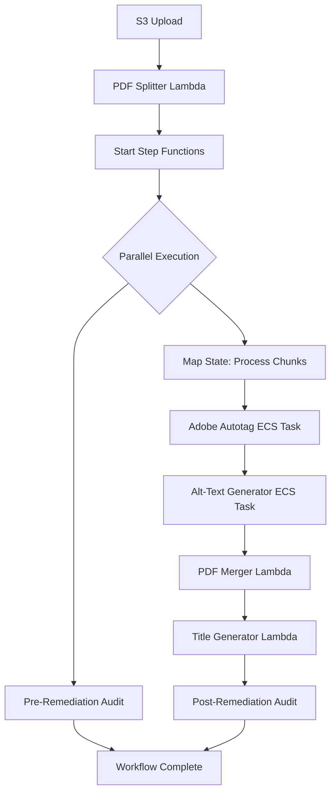

## Overview

The Remediation Workflow is an AWS Step Functions state machine that orchestrates the complete PDF accessibility remediation process. It coordinates multiple Lambda functions and ECS containers to transform PDFs into WCAG 2.1-compliant accessible documents.

## Workflow Architecture

The workflow consists of seven main stages:

1. **Split** - Divide PDF into chunks for parallel processing
2. **Map** - Execute parallel remediation for each chunk
3. **Autotag** - Apply Adobe PDF Services accessibility tagging
4. **Alt-Text** - Generate AI-powered alt text for images
5. **Merge** - Combine processed chunks into final PDF
6. **Title** - Generate accessible document title
7. **Audit** - Validate accessibility compliance (pre and post)

## State Machine Definition

```python
pdf_remediation_state_machine = sfn.StateMachine(
    definition=parallel_accessibility_workflow,
    timeout=Duration.minutes(150),
    logs=sfn.LogOptions(
        destination=pdf_remediation_workflow_log_group,
        level=sfn.LogLevel.ALL
    )
)
```

**Configuration:**
- **Timeout:** 150 minutes
- **Logging:** Full execution history in CloudWatch Logs
- **Log Group:** `/aws/states/pdf-accessibility-remediation-workflow`

## Workflow Stages

### 1. PDF Splitter (Trigger)

The workflow begins when a PDF is uploaded to S3:

```python
pdf_processing_bucket.add_event_notification(
    s3.EventType.OBJECT_CREATED,
    s3n.LambdaDestination(pdf_splitter_lambda),
    s3.NotificationKeyFilter(prefix="pdf/"),
    s3.NotificationKeyFilter(suffix=".pdf")
)
```

**Trigger:**
- S3 bucket event: Object created
- Prefix filter: `pdf/`
- Suffix filter: `.pdf`

**Splitter Lambda:**
```python
pdf_splitter_lambda = lambda_.Function(
    runtime=lambda_.Runtime.PYTHON_3_12,
    handler='main.lambda_handler',
    code=lambda_.Code.from_docker_build("lambda/pdf-splitter-lambda"),
    timeout=Duration.seconds(900),
    memory_size=1024
)
```

The Lambda function:
- Splits PDF into chunks for parallel processing
- Starts Step Functions execution
- Passes chunk metadata to the workflow

**Input to State Machine:**
```json
{
  "s3_bucket": "pdf-accessibility-bucket",
  "chunks": [
    {
      "s3_key": "temp/document-123/chunk-001.pdf",
      "s3_bucket": "pdf-accessibility-bucket",
      "chunk_key": "chunk-001.pdf"
    },
    {
      "s3_key": "temp/document-123/chunk-002.pdf",
      "s3_bucket": "pdf-accessibility-bucket",
      "chunk_key": "chunk-002.pdf"
    }
  ]
}
```

### 2. Parallel Accessibility Workflow

The main workflow runs two branches in parallel:

```python
parallel_accessibility_workflow = sfn.Parallel(
    result_path="$.ParallelResults"
)
parallel_accessibility_workflow.branch(remediation_chain)
parallel_accessibility_workflow.branch(pre_remediation_accessibility_checker_task)
```

**Branch 1: Remediation Chain**
- Map state (parallel chunk processing)
- PDF merger
- Title generator
- Post-remediation audit

**Branch 2: Pre-Remediation Audit**
- Runs concurrently with remediation
- Audits original PDF for baseline metrics

### 3. Map State (Parallel Chunk Processing)

Processes PDF chunks in parallel with controlled concurrency:

```python
pdf_chunks_map_state = sfn.Map(
    max_concurrency=100,
    items_path=sfn.JsonPath.string_at("$.chunks"),
    result_path="$.MapResults"
)

pdf_chunks_map_state.iterator(
    adobe_autotag_task.next(alt_text_generation_task)
)
```

**Configuration:**
- **Max Concurrency:** 100 parallel executions
- **Items Path:** `$.chunks` (array of chunk metadata)
- **Result Path:** `$.MapResults` (stores outputs)

**Iterator:** Each chunk goes through:
1. Adobe Autotag Task (ECS Fargate)
2. Alt-Text Generation Task (ECS Fargate)

### 4. Adobe Autotag Task

ECS Fargate task for PDF accessibility tagging:

```python
adobe_autotag_task = tasks.EcsRunTask(
    integration_pattern=sfn.IntegrationPattern.RUN_JOB,
    cluster=pdf_remediation_cluster,
    task_definition=adobe_autotag_task_def,
    assign_public_ip=False,
    container_overrides=[tasks.ContainerOverride(
        container_definition=adobe_autotag_container_def,
        environment=[
            tasks.TaskEnvironmentVariable(
                name="S3_BUCKET_NAME",
                value=sfn.JsonPath.string_at("$.s3_bucket")
            ),
            tasks.TaskEnvironmentVariable(
                name="S3_FILE_KEY",
                value=sfn.JsonPath.string_at("$.s3_key")
            ),
            tasks.TaskEnvironmentVariable(
                name="S3_CHUNK_KEY",
                value=sfn.JsonPath.string_at("$.chunk_key")
            ),
            tasks.TaskEnvironmentVariable(
                name="AWS_REGION",
                value=region
            )
        ]
    )],
    launch_target=tasks.EcsFargateLaunchTarget(
        platform_version=ecs.FargatePlatformVersion.LATEST
    ),
    propagated_tag_source=ecs.PropagatedTagSource.TASK_DEFINITION
)
```

**Integration Pattern:** `RUN_JOB` - Waits for task completion

**Task Resources:**
- CPU: 256 units (0.25 vCPU)
- Memory: 1024 MiB
- Network: Private subnet (no public IP)

**Environment Variables:**
- Dynamically injected from chunk metadata
- Values pulled from Step Functions input using JSONPath

### 5. Alt-Text Generation Task

ECS Fargate task for AI-powered alt-text generation:

```python
alt_text_generation_task = tasks.EcsRunTask(
    integration_pattern=sfn.IntegrationPattern.RUN_JOB,
    cluster=pdf_remediation_cluster,
    task_definition=alt_text_task_def,
    assign_public_ip=False,
    container_overrides=[tasks.ContainerOverride(
        container_definition=alt_text_container_def,
        environment=[
            tasks.TaskEnvironmentVariable(
                name="S3_BUCKET_NAME",
                value=sfn.JsonPath.string_at("$.Overrides.ContainerOverrides[0].Environment[0].Value")
            ),
            tasks.TaskEnvironmentVariable(
                name="S3_FILE_KEY",
                value=sfn.JsonPath.string_at("$.Overrides.ContainerOverrides[0].Environment[1].Value")
            ),
            tasks.TaskEnvironmentVariable(
                name="AWS_REGION",
                value=region
            )
        ]
    )],
    launch_target=tasks.EcsFargateLaunchTarget(
        platform_version=ecs.FargatePlatformVersion.LATEST
    ),
    propagated_tag_source=ecs.PropagatedTagSource.TASK_DEFINITION
)
```

**Environment Variables:**
- Passed from previous task output
- JSONPath extracts values from Adobe Autotag task result

### 6. PDF Merger Lambda

Combines processed chunks into final PDF:

```python
pdf_merger_lambda = lambda_.Function(
    runtime=lambda_.Runtime.JAVA_21,
    handler='com.example.App::handleRequest',
    code=lambda_.Code.from_asset('lambda/pdf-merger-lambda/PDFMergerLambda/target/PDFMergerLambda-1.0-SNAPSHOT.jar'),
    environment={
        'BUCKET_NAME': pdf_processing_bucket.bucket_name
    },
    timeout=Duration.seconds(900),
    memory_size=1024
)

pdf_merger_lambda_task = tasks.LambdaInvoke(
    lambda_function=pdf_merger_lambda,
    payload=sfn.TaskInput.from_object({
        "fileNames.$": "$.chunks[*].s3_key"
    }),
    output_path=sfn.JsonPath.string_at("$.Payload")
)
```

**Input:**
```json
{
  "fileNames": [
    "temp/document-123/chunk-001.pdf",
    "temp/document-123/chunk-002.pdf"
  ]
}
```

**Output:**
```json
{
  "merged_pdf_key": "temp/document-123/merged_final.pdf"
}
```

### 7. Title Generator Lambda

Generates accessible document title using AWS Bedrock:

```python
title_generator_lambda = lambda_.Function(
    runtime=lambda_.Runtime.PYTHON_3_12,
    handler='title_generator.lambda_handler',
    code=lambda_.Code.from_docker_build('lambda/title-generator-lambda'),
    timeout=Duration.seconds(900),
    memory_size=1024,
    architecture=lambda_arch
)

title_generator_lambda_task = tasks.LambdaInvoke(
    lambda_function=title_generator_lambda,
    payload=sfn.TaskInput.from_object({
        "Payload.$": "$"
    })
)
```

**Permissions:**
- Bedrock model invocation
- S3 read/write access
- CloudWatch metrics publishing

### 8. Accessibility Auditors

Validates accessibility compliance before and after remediation:

#### Pre-Remediation Auditor

```python
pre_remediation_accessibility_checker = lambda_.Function(
    runtime=lambda_.Runtime.PYTHON_3_12,
    handler='main.lambda_handler',
    code=lambda_.Code.from_docker_build('lambda/pre-remediation-accessibility-checker'),
    timeout=Duration.seconds(900),
    memory_size=512
)

pre_remediation_accessibility_checker_task = tasks.LambdaInvoke(
    lambda_function=pre_remediation_accessibility_checker,
    payload=sfn.TaskInput.from_json_path_at("$"),
    output_path="$.Payload"
)
```

#### Post-Remediation Auditor

```python
post_remediation_accessibility_checker = lambda_.Function(
    runtime=lambda_.Runtime.PYTHON_3_12,
    handler='main.lambda_handler',
    code=lambda_.Code.from_docker_build('lambda/post-remediation-accessibility-checker'),
    timeout=Duration.seconds(900),
    memory_size=512
)

post_remediation_accessibility_checker_task = tasks.LambdaInvoke(
    lambda_function=post_remediation_accessibility_checker,
    payload=sfn.TaskInput.from_json_path_at("$"),
    output_path="$.Payload"
)
```

**Both auditors:**
- Access Adobe PDF Accessibility Checker API via Secrets Manager
- Generate accessibility compliance reports
- Publish metrics to CloudWatch

## Workflow Execution Flow



## State Machine Input/Output

### Input Structure

```json
{
  "s3_bucket": "pdf-accessibility-bucket",
  "original_key": "pdf/document.pdf",
  "chunks": [
    {
      "s3_key": "temp/document-123/chunk-001.pdf",
      "s3_bucket": "pdf-accessibility-bucket",
      "chunk_key": "chunk-001.pdf"
    }
  ]
}
```

### Output Structure

```json
{
  "ParallelResults": [
    {
      "merged_pdf_key": "temp/document-123/FINAL_merged.pdf",
      "title": "Comprehensive Guide to PDF Accessibility",
      "post_audit": {
        "compliance_score": 95,
        "issues_found": 2,
        "report_url": "s3://bucket/reports/post-audit.pdf"
      }
    },
    {
      "pre_audit": {
        "compliance_score": 35,
        "issues_found": 87,
        "report_url": "s3://bucket/reports/pre-audit.pdf"
      }
    }
  ]
}
```

## Error Handling and Retries

### ECS Task Failures

**Integration Pattern:** `RUN_JOB` ensures Step Functions waits for task completion and captures failures.

**Container Exit Codes:**
- Exit 0: Success
- Exit 1: Failure (triggers Step Functions task failure)

### Lambda Retries

Step Functions automatically retries failed Lambda invocations based on error type.

### Map State Failures

**Behavior:**
- Individual chunk failures don't stop other chunks
- Failed chunks can be identified in `$.MapResults`
- Entire workflow fails only if critical tasks fail

## Monitoring Workflow Executions

### CloudWatch Logs

Full execution history is logged:

```python
pdf_remediation_workflow_log_group = logs.LogGroup(
    log_group_name="/aws/states/pdf-accessibility-remediation-workflow",
    retention=logs.RetentionDays.ONE_MONTH,
    removal_policy=cdk.RemovalPolicy.DESTROY
)
```

### CloudWatch Dashboard

Monitor workflow progress across all components:

```python
dashboard = cloudwatch.Dashboard(
    dashboard_name=f"PDF_Processing_Dashboard-{timestamp}",
    variables=[cloudwatch.DashboardVariable(
        id="filename",
        type=cloudwatch.VariableType.PATTERN,
        label="File Name",
        input_type=cloudwatch.VariableInputType.INPUT,
        value="filename",
        visible=True,
        default_value=cloudwatch.DefaultValue.value(".*")
    )]
)
```

**Dashboard Widgets:**
- File processing status across all stages
- Lambda function logs (splitter, merger, title generator)
- ECS container logs (Adobe Autotag, Alt-Text Generator)
- Step Functions execution logs

**Example Query:**
```
fields @timestamp, @message
| parse @message "File: *, Status: *" as file, status
| stats latest(status) as latestStatus by file
| sort file asc
```

### Step Functions Console

**Execution Details:**
- Visual workflow diagram with execution status
- Input/output for each state
- Execution timeline
- Error details and stack traces

**Starting an Execution:**
```bash
aws stepfunctions start-execution \
  --state-machine-arn arn:aws:states:region:account:stateMachine:PdfAccessibilityRemediationWorkflow \
  --input file://input.json
```

**Listing Executions:**
```bash
aws stepfunctions list-executions \
  --state-machine-arn arn:aws:states:region:account:stateMachine:PdfAccessibilityRemediationWorkflow \
  --status-filter RUNNING
```

**Describing an Execution:**
```bash
aws stepfunctions describe-execution \
  --execution-arn arn:aws:states:region:account:execution:PdfAccessibilityRemediationWorkflow:execution-id
```

## Parallel Execution Configuration

### Max Concurrency

```python
max_concurrency=100
```

**Benefits:**
- Up to 100 PDF chunks processed simultaneously
- Dramatically reduces total processing time for large documents
- Controlled to prevent resource exhaustion

**Resource Limits:**
- ECS cluster capacity
- Bedrock API throttling limits
- Adobe PDF Services API rate limits

### Network Configuration

**VPC Setup:**
```python
pdf_processing_vpc = ec2.Vpc(
    max_azs=2,
    nat_gateways=1,
    subnet_configuration=[
        ec2.SubnetConfiguration(
            subnet_type=ec2.SubnetType.PUBLIC,
            name="PdfProcessingPublic",
            cidr_mask=24
        ),
        ec2.SubnetConfiguration(
            subnet_type=ec2.SubnetType.PRIVATE_WITH_EGRESS,
            name="PdfProcessingPrivate",
            cidr_mask=24
        )
    ]
)
```

**VPC Endpoints (Cold Start Optimization):**
```python
pdf_processing_vpc.add_interface_endpoint("EcrApiEndpoint",
    service=ec2.InterfaceVpcEndpointAwsService.ECR
)
pdf_processing_vpc.add_interface_endpoint("EcrDockerEndpoint",
    service=ec2.InterfaceVpcEndpointAwsService.ECR_DOCKER
)
pdf_processing_vpc.add_gateway_endpoint("S3Endpoint",
    service=ec2.GatewayVpcEndpointAwsService.S3
)
```

**Benefits:**
- Reduces ECS cold start by 10-15 seconds
- Faster ECR image pulls
- Direct S3 access without NAT Gateway

## Workflow Timeout

```python
timeout=Duration.minutes(150)
```

**Rationale:**
- Allows processing of large PDFs (hundreds of pages)
- Accommodates peak load delays
- Prevents indefinite execution

## IAM Permissions

### Step Functions Execution Role

Auto-generated with permissions to:
- Invoke Lambda functions
- Start ECS tasks
- Write CloudWatch Logs

### Lambda Execution Roles

Each Lambda has permissions for:
- S3 read/write (scoped to bucket)
- CloudWatch metrics and logs
- Secrets Manager (for Adobe API credentials)
- Bedrock model invocation (title generator)

### ECS Task Roles

ECS tasks have permissions for:
- S3 read/write (scoped to bucket)
- Bedrock model invocation (alt-text generator)
- Secrets Manager (Adobe Autotag)
- AWS Comprehend (language detection)

## Related Resources

- [Adobe Autotag Container](/api/adobe-autotag)
- [Alt-Text Generator Container](/api/alt-text-generator)
- [Architecture Overview](/architecture)
- [Deployment Guide](/deployment)
