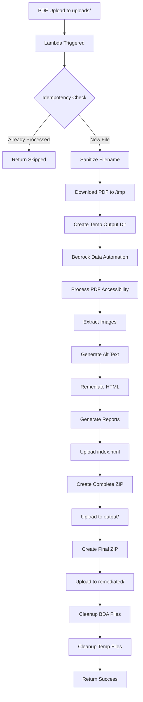

## Overview

The PDF-to-HTML remediation solution converts PDF documents to accessible HTML format using AWS Bedrock Data Automation for PDF parsing and a Lambda-based processing pipeline. This fully serverless architecture produces WCAG 2.1 Level AA compliant HTML with extracted images, alt text, and detailed remediation reports.

## Architecture Components

### S3 Bucket Structure

<Tabs>
  <Tab title="Bucket Configuration">
    ```yaml
    Bucket Name: pdf2html-bucket-{suffix}
    Encryption: S3 managed (SSE-S3)
    SSL: Enforced
    Versioning: Optional (configurable)
    Event Notifications: Enabled for uploads/ prefix
    ```
  </Tab>
  <Tab title="Folder Structure">
    ```
    pdf2html-bucket-*/
    ├── uploads/              # Input PDFs (trigger processing)
    ├── bda-inputs/           # Copies for Bedrock Data Automation
    ├── bda-processing/       # Bedrock intermediate outputs
    │   └── {filename}/
    ├── output/               # Complete processing outputs
    │   ├── {filename}.html   # Main output file
    │   └── {filename}.zip    # Full output archive
    └── remediated/           # Final user-facing results
        └── final_{filename}.zip  # Curated output package
    ```
  </Tab>
</Tabs>

<Info>
Uploading a PDF to the `uploads/` folder automatically triggers the Lambda function via S3 event notification.
</Info>

## Processing Workflow

### Lambda Function Configuration

**Function Name**: `Pdf2HtmlPipeline`

**Runtime Configuration**:
- **Runtime**: Python 3.12
- **Memory**: 10,240 MB (10 GB)
- **Timeout**: 900 seconds (15 minutes)
- **Ephemeral Storage**: 15 GB (for large PDF processing)
- **Architecture**: Container-based deployment
- **Image**: Built from `pdf2html/` directory with accessibility utility
- **Log Group**: `/aws/lambda/Pdf2HtmlPipeline`

**Environment Variables**:
- `CLEANUP_INTERMEDIATE_FILES`: `true` (enable automatic cleanup)
- `BDA_OUTPUT_PREFIX`: `bda-processing` (Bedrock output location)
- Additional Bedrock configuration injected by CDK

### Trigger Configuration

**S3 Event Notification** (lambda_function.py:81-95):
- **Event Type**: `s3:ObjectCreated:*`
- **Prefix Filter**: `uploads/`
- **Suffix Filter**: `.pdf`

**Filtering Logic**:
```python
# Only processes files in uploads/ root folder
if not key.startswith("uploads/"):
    return {"status": "skipped", "message": "Not in uploads/ folder"}

# Must be a PDF file
if not key.lower().endswith('.pdf'):
    return {"status": "skipped", "message": "Not a PDF file"}

# No subfolders (single-level uploads only)
if key.count('/') > 1:
    return {"status": "skipped", "message": "File is in a subfolder"}
```

### Processing Pipeline



### Detailed Processing Steps

#### 1. Event Handling and Validation

**Code**: lambda_function.py:44-106

**Operations**:
1. Parse S3 event notification (lambda_function.py:60-76)
2. URL decode object key (handles spaces and special characters)
3. Validate file is in `uploads/` folder
4. Validate file has `.pdf` extension
5. Ensure file is at root level (not in subfolder)
6. Sanitize filename (replace spaces and special chars with underscores)

**Filename Sanitization** (lambda_function.py:13-42):
```python
def sanitize_filename(filename):
    # Replace spaces with underscores
    sanitized = filename.replace(' ', '_')
    
    # Remove problematic characters: # % & { } \ < > * ? / $ ! ' " : @ + ` | =
    for char in problematic_chars:
        sanitized = sanitized.replace(char, '_')
    
    # Collapse multiple underscores
    while '__' in sanitized:
        sanitized = sanitized.replace('__', '_')
    
    # Remove leading/trailing underscores
    return sanitized.strip('_')
```

<Warning>
Filename sanitization prevents S3 key issues and ensures cross-platform compatibility. Original filename is preserved in response metadata.
</Warning>

#### 2. Idempotency Check

**Code**: lambda_function.py:107-134

**Logic**:
1. Check for existing output at `output/{filename}.zip`
2. Also check using original filename for backward compatibility
3. If output exists, skip processing and return existing result location
4. Prevents duplicate processing and unnecessary Bedrock costs

```python
# Checks both sanitized and original filenames
output_check_keys = [
    f"output/{filename_base}.zip",
    f"output/{os.path.splitext(original_filename)[0]}.zip"
]

for output_check_key in output_check_keys:
    try:
        s3.head_object(Bucket=bucket, Key=output_check_key)
        return {"status": "skipped", "message": "Output already exists"}
    except ClientError as e:
        if e.response['Error']['Code'] != '404':
            raise
```

#### 3. PDF Download

**Code**: lambda_function.py:136-144

**Operations**:
1. Download PDF from S3 to `/tmp/{sanitized_filename}`
2. Use sanitized filename for local processing
3. Log download success/failure
4. Return error if download fails

**Error Handling**:
- Catches download exceptions
- Logs full stack trace to CloudWatch
- Returns descriptive error message to caller

#### 4. Bedrock Data Automation Processing

**Code**: lambda_function.py:147-169

**API Integration**:
```python
from content_accessibility_utility_on_aws.api import process_pdf_accessibility

conversion_result = process_pdf_accessibility(
    pdf_path=local_in,
    output_dir=temp_output_dir,
    perform_audit=True,
    perform_remediation=True,
    conversion_options={
        "cleanup_bda_output": True,
        "single_file": True
    }
)
```

**Parameters**:
- `pdf_path`: Local path to downloaded PDF
- `output_dir`: Temporary directory in `/tmp` (auto-created)
- `perform_audit`: Enable pre-remediation accessibility audit
- `perform_remediation`: Apply accessibility fixes
- `cleanup_bda_output`: Remove Bedrock intermediate files from S3
- `single_file`: Generate single-file HTML output

**Bedrock Data Automation Tasks**:
1. **PDF Parsing**: Extract text, layout, and structure
2. **Image Extraction**: Identify and extract embedded images
3. **Table Detection**: Recognize tabular data
4. **Document Structure**: Identify headings, paragraphs, lists
5. **Semantic Analysis**: Understand document hierarchy

#### 5. Accessibility Remediation

**Content Accessibility Utility** (from AWS Labs):

**Features**:
- **Semantic HTML**: Converts PDF structure to proper HTML5 tags
- **ARIA Labels**: Adds accessibility attributes
- **Alt Text Generation**: Uses Bedrock to generate image descriptions
- **Heading Hierarchy**: Ensures proper h1-h6 structure
- **Table Accessibility**: Adds scope, headers, and caption attributes
- **Color Contrast**: Ensures WCAG AA contrast ratios
- **Keyboard Navigation**: Ensures focusable elements
- **Screen Reader Optimization**: Proper landmark regions and skip links

**Output Files Generated**:
1. `index.html`: Main accessible HTML file
2. `remediated_html/`: Folder with remediated HTML
   - `remediated.html`: Final WCAG-compliant HTML
   - `result.html`: Original HTML conversion (pre-remediation)
3. `images/`: Extracted images with metadata
4. `remediation_report.html`: Detailed accessibility improvements
5. `usage_data.json`: Processing metrics and statistics

#### 6. Output File Handling

**Index.html Upload** (lambda_function.py:172-190):
```python
# Upload main HTML file for quick access
index_html_path = os.path.join(temp_output_dir, "index.html")
if os.path.exists(index_html_path):
    index_s3_key = f"output/{filename_base}.html"
    s3.upload_file(index_html_path, bucket, index_s3_key)
```

**Complete ZIP Archive** (lambda_function.py:261-278):
```python
# Archive all output files
with zipfile.ZipFile(zip_path, 'w', zipfile.ZIP_DEFLATED) as zipf:
    for root, dirs, files in os.walk(temp_output_dir):
        for file in files:
            file_path = os.path.join(root, file)
            rel_path = os.path.relpath(file_path, temp_output_dir)
            zipf.write(file_path, rel_path)

# Upload to output/ folder
output_s3_key = f"output/{filename_base}.zip"
s3.upload_file(zip_path, bucket, output_s3_key)
```

**Final User-Facing ZIP** (lambda_function.py:281-312):
```python
# Create curated ZIP with only essential files
include_patterns = [
    "remediated_html/",      # Final accessible HTML
    "usage_data.json",       # Processing metrics
    "remediation_report.html" # Accessibility report
]

with zipfile.ZipFile(final_zip_path, 'w', zipfile.ZIP_DEFLATED) as final_zipf:
    for root, dirs, files in os.walk(temp_output_dir):
        for file in files:
            file_path = os.path.join(root, file)
            rel_path = os.path.relpath(file_path, temp_output_dir)
            
            # Only include specified patterns
            if any(pattern.lower() in rel_path.lower() for pattern in include_patterns):
                final_zipf.write(file_path, rel_path)

# Upload to remediated/ folder
remediated_s3_key = f"remediated/final_{filename_base}.zip"
s3.upload_file(final_zip_path, bucket, remediated_s3_key)
```

<Info>
Two ZIP files are created:
- **Complete ZIP** (`output/`): All files including debug outputs
- **Final ZIP** (`remediated/`): Curated package for end users
</Info>

#### 7. Cleanup Operations

**Intermediate File Cleanup** (lambda_function.py:192-258):

**Configurable via Environment Variable**:
```python
cleanup_enabled = os.environ.get("CLEANUP_INTERMEDIATE_FILES", "true").lower() == "true"
```

**Files Cleaned**:

1. **Bedrock Processing Files** (lambda_function.py:199-220):
   ```python
   # Delete all files in bda-processing/{filename}/
   bda_processing_prefix = f"{bda_output_prefix}/{filename_base}/"
   
   # Paginate and delete in batches of 1000
   paginator = s3.get_paginator('list_objects_v2')
   for page in paginator.paginate(Bucket=bucket, Prefix=bda_processing_prefix):
       if 'Contents' in page:
           for obj in page['Contents']:
               objects_to_delete.append({'Key': obj['Key']})
   
   # Batch delete
   s3.delete_objects(
       Bucket=bucket,
       Delete={'Objects': objects_to_delete}
   )
   ```

2. **BDA Input Files** (lambda_function.py:222-228):
   ```python
   # Delete copy sent to Bedrock Data Automation
   bda_input_key = f"bda-inputs/{sanitized_filename}"
   s3.delete_object(Bucket=bucket, Key=bda_input_key)
   ```

3. **Old Output Files** (lambda_function.py:231-253):
   ```python
   # Clean up old individual output files (keep ZIP archives)
   old_output_prefix = f"output/{filename_base}/"
   
   # Delete all except .zip and .html files
   for obj in objects:
       if not obj['Key'].endswith(f"{filename_base}.zip") and \
          not obj['Key'].endswith(f"{filename_base}.html"):
           old_objects_to_delete.append({'Key': obj['Key']})
   ```

4. **Temporary Local Files** (lambda_function.py:333-340):
   ```python
   # Always cleanup /tmp directory (runs in finally block)
   try:
       if temp_output_dir and os.path.exists(temp_output_dir):
           shutil.rmtree(temp_output_dir)
   except Exception as e:
       print(f"[WARNING] Failed to clean up temporary directory: {e}")
   ```

<Warning>
Cleanup failures are logged as warnings but do not fail the Lambda function. This ensures output files are always delivered even if cleanup has issues.
</Warning>

## IAM Permissions

### Lambda Execution Role

**Managed Policies**:
- `AWSLambdaBasicExecutionRole`: CloudWatch Logs write access

**Custom Policies**:

<Tabs>
  <Tab title="S3 Permissions">
    ```json
    {
      "Effect": "Allow",
      "Action": [
        "s3:GetObject",
        "s3:PutObject",
        "s3:DeleteObject",
        "s3:ListBucket"
      ],
      "Resource": [
        "arn:aws:s3:::pdf2html-bucket-*",
        "arn:aws:s3:::pdf2html-bucket-*/*"
      ]
    }
    ```
  </Tab>
  <Tab title="Bedrock Permissions">
    ```json
    {
      "Effect": "Allow",
      "Action": [
        "bedrock:InvokeModel",
        "bedrock:CreateDataAutomationProject",
        "bedrock:StartDocumentAnalysis",
        "bedrock:GetDocumentAnalysis"
      ],
      "Resource": "*"
    }
    ```
    Note: Bedrock Data Automation does not support resource-level permissions
  </Tab>
  <Tab title="CloudWatch Permissions">
    ```json
    {
      "Effect": "Allow",
      "Action": [
        "logs:CreateLogGroup",
        "logs:CreateLogStream",
        "logs:PutLogEvents"
      ],
      "Resource": "arn:aws:logs:*:*:log-group:/aws/lambda/Pdf2HtmlPipeline:*"
    }
    ```
  </Tab>
</Tabs>

## Output Package Structure

### Final ZIP Contents

```
final_{filename}.zip
├── remediated_html/
│   ├── remediated.html      # WCAG 2.1 AA compliant HTML
│   ├── result.html          # Original conversion (comparison)
│   └── images/              # Extracted images
│       ├── image_001.png
│       ├── image_001_alt.txt # AI-generated alt text
│       ├── image_002.png
│       └── image_002_alt.txt
├── remediation_report.html  # Detailed accessibility improvements
└── usage_data.json          # Processing metrics
```

### Remediation Report

**Contains**:
- Pre-remediation accessibility violations
- Applied fixes and improvements
- WCAG 2.1 success criteria addressed
- Element-by-element changes
- Before/after code samples
- Validation results

### Usage Data JSON

**Schema**:
```json
{
  "input_file": "original_filename.pdf",
  "sanitized_file": "sanitized_filename.pdf",
  "processing_time_seconds": 45.3,
  "bedrock_invocations": 12,
  "images_processed": 8,
  "alt_texts_generated": 8,
  "pages_processed": 25,
  "output_size_bytes": 1048576,
  "accessibility_issues_found": 47,
  "accessibility_issues_fixed": 45,
  "wcag_level": "AA",
  "timestamp": "2026-03-11T16:30:00Z",
  "execution_id": "xxxxxxxx-xxxx-xxxx-xxxx-xxxxxxxxxxxx"
}
```

## Performance Characteristics

### Processing Time

<Tabs>
  <Tab title="Small PDF (1-10 pages)">
    - **Total Time**: 30-60 seconds
    - **Bedrock**: 15-30 seconds
    - **Remediation**: 10-20 seconds
    - **Upload**: 5-10 seconds
  </Tab>
  <Tab title="Medium PDF (10-50 pages)">
    - **Total Time**: 1-3 minutes
    - **Bedrock**: 30-90 seconds
    - **Remediation**: 30-60 seconds
    - **Upload**: 10-30 seconds
  </Tab>
  <Tab title="Large PDF (50-200 pages)">
    - **Total Time**: 3-8 minutes
    - **Bedrock**: 90-300 seconds
    - **Remediation**: 60-180 seconds
    - **Upload**: 30-60 seconds
  </Tab>
  <Tab title="Very Large PDF (200+ pages)">
    - **Total Time**: 8-15 minutes (may timeout at 900s)
    - **Recommendation**: Split into smaller PDFs
  </Tab>
</Tabs>

<Warning>
PDFs over 200 pages may exceed the 15-minute Lambda timeout. Consider increasing timeout or implementing chunked processing for very large documents.
</Warning>

### Memory Usage

**Lambda Memory**: 10,240 MB (10 GB)

**Typical Usage**:
- **Small PDFs**: 1-2 GB
- **Medium PDFs**: 2-5 GB
- **Large PDFs**: 5-8 GB
- **Very Large PDFs**: 8-10 GB

**Ephemeral Storage**: 15 GB `/tmp`
- **PDF Storage**: Original + intermediate files
- **Output Directory**: HTML, images, reports
- **ZIP Files**: Complete and final archives

## Error Handling

### Try-Except Blocks

**Levels of Error Handling** (lambda_function.py:44-340):

1. **Outer Try-Except** (lambda_function.py:58-332):
   - Catches all unhandled exceptions
   - Logs full stack trace
   - Returns `{"status": "error", "message": ...}`

2. **Download Try-Except** (lambda_function.py:138-144):
   - Specific to S3 download failures
   - Returns early with download error

3. **Processing Try-Except** (lambda_function.py:151-169):
   - Catches Bedrock and remediation errors
   - Logs processing failure details

4. **Upload Try-Except** (lambda_function.py:172-317):
   - Catches ZIP creation/upload failures
   - Distinguishes between file operations

5. **Cleanup Try-Except** (lambda_function.py:255-256):
   - Non-fatal cleanup errors logged as warnings
   - Does not fail the function

6. **Finally Block** (lambda_function.py:333-340):
   - Always cleans up `/tmp` directory
   - Runs even if function fails

### Logging Strategy

**Log Levels**:
- `[INFO]`: Normal processing steps
- `[DEBUG]`: Detailed debugging information
- `[WARNING]`: Non-fatal issues (cleanup failures)
- `[ERROR]`: Processing failures

**Log Format**:
```python
print(f"[INFO] Processing s3://{bucket}/{key}")
print(f"[INFO] Lambda execution ID: {context.aws_request_id}")
print(f"[ERROR] Failed to download s3://{bucket}/{key}: {e}")
print(traceback.format_exc())  # Full stack trace
```

## Monitoring and Observability

### CloudWatch Logs

**Log Group**: `/aws/lambda/Pdf2HtmlPipeline`

**Key Log Patterns**:

<Tabs>
  <Tab title="Successful Processing">
    ```
    [INFO] Lambda execution ID: xxx
    [INFO] Processing s3://bucket/uploads/file.pdf
    [INFO] Original filename: file.pdf, Sanitized filename: file.pdf
    [INFO] Downloaded s3://bucket/uploads/file.pdf to /tmp/file.pdf
    [INFO] Created temporary directory: /tmp/accessibility_xxx
    [INFO] Processing PDF: /tmp/file.pdf
    [INFO] Processing complete. Result: {...}
    [INFO] Added to zip: remediated.html
    [INFO] Uploaded complete zip to s3://bucket/output/file.zip
    [INFO] Uploaded final zip to s3://bucket/remediated/final_file.zip
    [INFO] Cleaning up Bedrock intermediate files
    [INFO] Cleaned up temporary directory: /tmp/accessibility_xxx
    ```
  </Tab>
  <Tab title="Skipped (Idempotency)">
    ```
    [INFO] Lambda execution ID: xxx
    [INFO] Processing s3://bucket/uploads/file.pdf
    [INFO] Output already exists at s3://bucket/output/file.zip, skipping
    ```
  </Tab>
  <Tab title="Error Processing">
    ```
    [INFO] Lambda execution ID: xxx
    [INFO] Processing s3://bucket/uploads/file.pdf
    [ERROR] Failed to download s3://bucket/uploads/file.pdf: Access Denied
    Traceback (most recent call last):
      ...
    [ERROR] Unhandled exception: ...
    ```
  </Tab>
</Tabs>

### CloudWatch Metrics

**Lambda Metrics** (automatic):
- `Invocations`: Number of Lambda executions
- `Duration`: Processing time in milliseconds
- `Errors`: Number of failed executions
- `Throttles`: Number of throttled requests
- `ConcurrentExecutions`: Number of parallel executions

**Custom Metrics** (if implemented):
- Processing time by PDF size
- Bedrock invocation count
- Images processed count
- Success/failure rate

### Alarms (Recommended)

<CardGroup cols={2}>
  <Card title="High Error Rate" icon="triangle-exclamation">
    Alert when error rate > 5% over 5 minutes
  </Card>
  <Card title="Long Duration" icon="clock">
    Alert when duration > 10 minutes (approaching timeout)
  </Card>
  <Card title="Throttling" icon="hand">
    Alert on any throttled executions
  </Card>
  <Card title="No Invocations" icon="pause">
    Alert if no invocations for 24 hours (if expecting traffic)
  </Card>
</CardGroup>

## Cost Analysis

### Per-PDF Cost Estimate (50 pages, 10 images)

<Tabs>
  <Tab title="Compute">
    - **Lambda Duration**: 2 minutes
    - **Lambda Memory**: 10,240 MB
    - **Lambda Cost**: ~$0.03 (10GB × 120s × $0.0000166667/GB-second)
    - **Lambda Requests**: $0.0000002 (negligible)
    - **Total Compute**: ~$0.03
  </Tab>
  <Tab title="Bedrock Data Automation">
    - **Document Analysis**: ~$0.15 per document (pricing varies by region)
    - **Image Analysis**: ~$0.01 per image × 10 = $0.10
    - **Total Bedrock**: ~$0.25
  </Tab>
  <Tab title="Storage & Transfer">
    - **S3 PUT Requests**: ~20 uploads × $0.000005 = $0.0001
    - **S3 GET Requests**: ~5 downloads × $0.0000004 = $0.000002
    - **S3 Storage**: Less than $0.001 (temporary, cleaned up)
    - **CloudWatch Logs**: ~$0.005 (500 KB ingestion)
    - **Total Storage**: ~$0.006
  </Tab>
</Tabs>

**Total Cost per PDF**: ~$0.29

<Info>
Bedrock Data Automation is the primary cost driver. Bulk processing significantly reduces per-document costs through economies of scale.
</Info>

### Monthly Cost Projection

| PDFs/Month | Compute | Bedrock | Storage | Total |
|------------|---------|---------|---------|-------|
| 100        | $3      | $25     | $1      | $29   |
| 1,000      | $30     | $250    | $10     | $290  |
| 10,000     | $300    | $2,500  | $100    | $2,900|

## Security Best Practices

### Data Privacy

<AccordionGroup>
  <Accordion title="Temporary Storage">
    - All processing happens in Lambda `/tmp` (ephemeral)
    - Automatic cleanup after execution (finally block)
    - No persistent local storage
  </Accordion>
  
  <Accordion title="S3 Encryption">
    - Server-side encryption enabled (SSE-S3)
    - HTTPS required for all S3 operations
    - Bucket policies enforce encryption
  </Accordion>
  
  <Accordion title="Bedrock Data Handling">
    - Bedrock Data Automation does not retain data
    - Intermediate files automatically deleted
    - No data sent outside AWS region
  </Accordion>
  
  <Accordion title="Logging">
    - No PII or sensitive content in logs
    - Log retention configurable (default: indefinite)
    - Consider log encryption for compliance
  </Accordion>
</AccordionGroup>

### Network Security

- **VPC Optional**: Lambda can run in VPC for enhanced isolation
- **VPC Endpoints**: Use S3 and Bedrock VPC endpoints for private connectivity
- **No Public Endpoints**: All communication through AWS backbone

### IAM Best Practices

- **Least Privilege**: Lambda role has minimal required permissions
- **Resource Scoping**: S3 permissions limited to specific bucket
- **No Wildcards**: Avoid `*` in resource ARNs where possible
- **Regular Audits**: Review CloudTrail logs for unauthorized access

## Troubleshooting

### Common Issues

<AccordionGroup>
  <Accordion title="Lambda Timeout (900s exceeded)">
    **Symptoms**: Function times out, partial output in S3
    
    **Causes**:
    - PDF too large (>200 pages)
    - Many complex images requiring alt-text
    - Bedrock throttling or slow responses
    
    **Solutions**:
    - Increase Lambda timeout (CDK: `timeout=Duration.minutes(15)`)
    - Split large PDFs into smaller chunks
    - Implement pagination for Bedrock calls
  </Accordion>
  
  <Accordion title="Out of Memory">
    **Symptoms**: Lambda exits with "out of memory" error
    
    **Causes**:
    - Very large PDF files (>100 MB)
    - Many high-resolution images
    - Insufficient Lambda memory (current: 10 GB)
    
    **Solutions**:
    - Reduce PDF size before upload (compress images)
    - Increase Lambda memory configuration
    - Stream large files instead of loading into memory
  </Accordion>
  
  <Accordion title="Bedrock AccessDeniedException">
    **Symptoms**: `botocore.exceptions.ClientError: AccessDeniedException`
    
    **Causes**:
    - Bedrock Data Automation not enabled in region
    - Insufficient IAM permissions
    - Model access not granted
    
    **Solutions**:
    - Enable Bedrock Data Automation in AWS Console
    - Add `bedrock:*` permissions to Lambda role
    - Request model access in Bedrock console
  </Accordion>
  
  <Accordion title="Infinite Lambda Invocations">
    **Symptoms**: Lambda invoked repeatedly, high costs
    
    **Causes**:
    - S3 event notification loop (Lambda writes to trigger bucket)
    - Incorrect prefix filters
    
    **Solutions**:
    - Ensure Lambda only writes to `output/` and `remediated/` (not `uploads/`)
    - Verify S3 event filter is `uploads/` only
    - Check idempotency logic is working
  </Accordion>
  
  <Accordion title="Cleanup Failures">
    **Symptoms**: Warning logs about cleanup, intermediate files remain
    
    **Causes**:
    - S3 pagination issues with large file sets
    - Insufficient delete permissions
    - Objects locked or versioned
    
    **Solutions**:
    - Check CloudWatch logs for specific errors
    - Verify IAM permissions include `s3:DeleteObject`
    - Manually delete stuck files via AWS Console
    - Set S3 lifecycle policy to auto-delete old files
  </Accordion>
</AccordionGroup>

### Debug Mode

To enable verbose logging for troubleshooting:

```python
# Add to lambda_function.py
import logging
logging.basicConfig(level=logging.DEBUG)
```

This will output additional details from the Content Accessibility Utility and Bedrock SDK.

## Deployment Configuration

### CDK Stack (Example)

```python
from aws_cdk import (
    Stack,
    Duration,
    aws_lambda as lambda_,
    aws_s3 as s3,
    aws_s3_notifications as s3n,
    aws_iam as iam,
)

class Pdf2HtmlStack(Stack):
    def __init__(self, scope, construct_id, **kwargs):
        super().__init__(scope, construct_id, **kwargs)
        
        # S3 Bucket
        bucket = s3.Bucket(
            self, "Pdf2HtmlBucket",
            encryption=s3.BucketEncryption.S3_MANAGED,
            enforce_ssl=True,
            removal_policy=cdk.RemovalPolicy.RETAIN
        )
        
        # Lambda Function
        pdf2html_lambda = lambda_.Function(
            self, "Pdf2HtmlPipeline",
            runtime=lambda_.Runtime.PYTHON_3_12,
            handler="lambda_function.lambda_handler",
            code=lambda_.Code.from_docker_build("pdf2html"),
            memory_size=10240,  # 10 GB
            timeout=Duration.seconds(900),  # 15 minutes
            ephemeral_storage_size=cdk.Size.gibibytes(15),
            environment={
                "CLEANUP_INTERMEDIATE_FILES": "true",
                "BDA_OUTPUT_PREFIX": "bda-processing"
            }
        )
        
        # Grant permissions
        bucket.grant_read_write(pdf2html_lambda)
        pdf2html_lambda.add_to_role_policy(
            iam.PolicyStatement(
                actions=["bedrock:*"],
                resources=["*"]
            )
        )
        
        # S3 Event Notification
        bucket.add_event_notification(
            s3.EventType.OBJECT_CREATED,
            s3n.LambdaDestination(pdf2html_lambda),
            s3.NotificationKeyFilter(prefix="uploads/", suffix=".pdf")
        )
```

### Prerequisites

<Steps>
  <Step title="Enable Bedrock Data Automation">
    Navigate to Amazon Bedrock console and enable Data Automation in your region.
  </Step>
  <Step title="Request Model Access">
    Request access to foundation models used for alt-text generation (if not already granted).
  </Step>
  <Step title="Install Dependencies">
    ```bash
    cd pdf2html
    pip install -r requirements.txt
    ```
  </Step>
  <Step title="Build Docker Image">
    ```bash
    docker build -t pdf2html-lambda .
    ```
  </Step>
  <Step title="Deploy CDK Stack">
    ```bash
    cdk deploy Pdf2HtmlStack
    ```
  </Step>
</Steps>

## Next Steps

<CardGroup cols={2}>
  <Card title="Deploy PDF-to-HTML" icon="rocket" href="/deployment/one-click-deployment">
    Deploy this solution to your AWS account
  </Card>
  <Card title="PDF-to-PDF Architecture" icon="file-pdf" href="/architecture/pdf-to-pdf">
    Compare with the PDF preservation solution
  </Card>
  <Card title="Configure Bedrock" icon="brain" href="/configuration/bedrock-setup">
    Optimize Bedrock Data Automation settings
  </Card>
  <Card title="Monitor Processing" icon="chart-line" href="/operations/monitoring">
    Set up CloudWatch alarms and dashboards
  </Card>
</CardGroup>