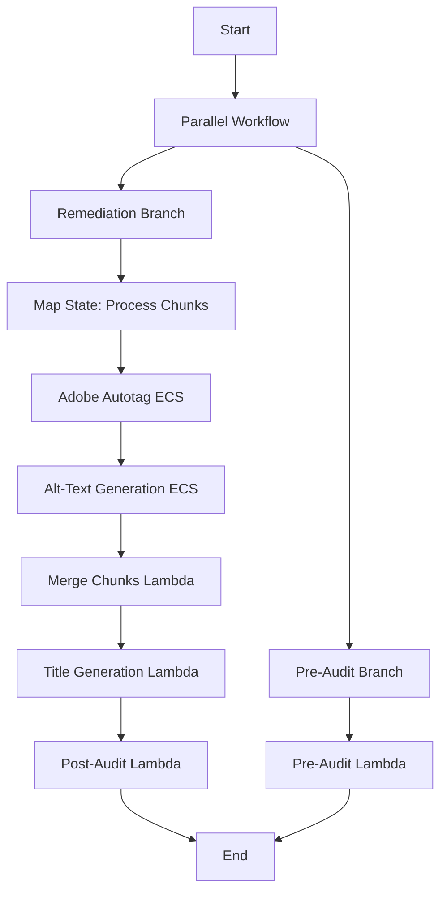

## Overview

The PDF-to-PDF remediation solution processes PDF documents while maintaining the original PDF format. It leverages Adobe PDF Services API for structural tagging and Amazon Bedrock for AI-generated content improvements, orchestrated through a sophisticated AWS Step Functions workflow.

## Architecture Components

### S3 Bucket Structure

<Tabs>
  <Tab title="Bucket Configuration">
    ```python
    # From app.py:28-32
    Bucket Configuration:
    - Name: pdfaccessibilitybucket1 (auto-generated suffix)
    - Encryption: S3_MANAGED (SSE-S3)
    - SSL: Enforced for all connections
    - Versioning: Enabled
    - Removal Policy: RETAIN
    ```
  </Tab>
  <Tab title="Folder Structure">
    ```
    pdfaccessibility-*/
    ├── pdf/              # Input PDFs (trigger processing)
    ├── temp/             # Intermediate chunk processing
    │   └── {filename}/
    │       └── {filename}_chunk_N.pdf
    └── result/           # Final compliant PDFs
        └── COMPLIANT_{filename}.pdf
    ```
  </Tab>
</Tabs>

<Info>
Uploading a PDF to the `pdf/` folder automatically triggers the remediation workflow via S3 event notification.
</Info>

## Processing Workflow

### 1. PDF Splitter Lambda

**Trigger**: S3 ObjectCreated event on `pdf/*.pdf`

**Configuration** (app.py:385-392):
- **Runtime**: Python 3.12
- **Handler**: `main.lambda_handler`
- **Memory**: 1024 MB
- **Timeout**: 900 seconds (15 minutes)
- **Code**: Docker container from `lambda/pdf-splitter-lambda`

**Functionality** (main.py:107-185):
1. Downloads PDF from S3 (`pdf/{filename}.pdf`)
2. Splits PDF into 200-page chunks using PyPDF
3. Uploads chunks to `temp/{filename}/{filename}_chunk_N.pdf`
4. Invokes Step Functions state machine with chunk metadata
5. Logs processing status to CloudWatch

```python
# Chunk structure passed to Step Functions
{
  "chunks": [
    {
      "s3_bucket": "bucket-name",
      "s3_key": "temp/filename/filename_chunk_1.pdf",
      "chunk_key": "temp/filename/filename_chunk_1.pdf"
    }
  ],
  "s3_bucket": "bucket-name"
}
```

### 2. Step Functions State Machine

**Name**: `PdfAccessibilityRemediationWorkflow`

**Configuration** (app.py:376-382):
- **Timeout**: 150 minutes
- **Logging**: Full execution history to CloudWatch
- **Log Group**: `/aws/states/pdf-accessibility-remediation-workflow`
- **Retention**: 1 month

**Workflow Structure**:



**Parallel Processing** (app.py:234-240):
- **Max Concurrency**: 100 parallel chunk processing tasks
- **Items Path**: `$.chunks`
- **Result Path**: `$.MapResults`

The parallel workflow executes pre-remediation accessibility checking concurrently with the main remediation pipeline for efficiency.

### 3. ECS Fargate Tasks

#### VPC Configuration

**Network Architecture** (app.py:59-85):
- **Max AZs**: 2 availability zones
- **NAT Gateways**: 1 (shared across AZs for cost optimization)
- **Subnets**:
  - Public subnet: `/24` CIDR (for NAT gateway)
  - Private subnet with egress: `/24` CIDR (for ECS tasks)
- **VPC Endpoints** (reduces cold start by 10-15 seconds):
  - ECR API endpoint
  - ECR Docker endpoint
  - S3 gateway endpoint

<Warning>
ECS tasks run in private subnets without public IPs. VPC endpoints provide secure, low-latency access to AWS services.
</Warning>

#### Adobe Autotag Task

**Task Definition** (app.py:146-157):
- **Launch Type**: Fargate
- **Platform Version**: LATEST
- **CPU**: 256 (0.25 vCPU)
- **Memory**: 1024 MB
- **Image**: Built from `adobe-autotag-container` with zstd compression
- **Log Group**: `/ecs/pdf-remediation/adobe-autotag`
- **Public IP**: Disabled (runs in private subnet)

**Image Optimization** (app.py:40-47):
```python
# zstd compression for 2-3x faster decompression on Fargate
platform: LINUX_AMD64
compression: zstd
compression-level: 3
force-compression: true
```

**Environment Variables** (app.py:180-197):
- `S3_BUCKET_NAME`: Processing bucket name
- `S3_FILE_KEY`: Original PDF S3 key
- `S3_CHUNK_KEY`: Chunk file S3 key
- `AWS_REGION`: Deployment region

**IAM Permissions** (app.py:104-132):
- Bedrock model invocation (all models)
- S3 read/write on processing bucket
- Comprehend language detection
- Secrets Manager access to Adobe credentials: `/myapp/*`

**Functionality**:
1. Downloads PDF chunk from S3
2. Calls Adobe PDF Services API to add structural tags
3. Uploads tagged PDF chunk back to S3
4. Logs processing status

#### Alt-Text Generation Task

**Task Definition** (app.py:159-170):
- **Launch Type**: Fargate
- **Platform Version**: LATEST
- **CPU**: 256 (0.25 vCPU)
- **Memory**: 1024 MB
- **Image**: Built from `alt-text-generator-container` with zstd compression
- **Log Group**: `/ecs/pdf-remediation/alt-text-generator`
- **Public IP**: Disabled

**Environment Variables** (app.py:213-226):
- `S3_BUCKET_NAME`: From previous Adobe task output
- `S3_FILE_KEY`: From previous Adobe task output
- `AWS_REGION`: Deployment region

**Functionality**:
1. Downloads tagged PDF chunk from S3
2. Extracts images from PDF
3. Generates alt text using Amazon Bedrock (Nova Pro model)
4. Embeds alt text into PDF structure
5. Uploads enhanced chunk back to S3

**Bedrock Model**: Amazon Nova Pro (`us.amazon.nova-pro-v1:0`)

### 4. PDF Merger Lambda

**Configuration** (app.py:246-265):
- **Runtime**: Java 21
- **Handler**: `com.example.App::handleRequest`
- **Memory**: 1024 MB
- **Timeout**: 900 seconds (15 minutes)
- **Code**: JAR from `lambda/pdf-merger-lambda/PDFMergerLambda/target/`

**Environment Variables**:
- `BUCKET_NAME`: Processing bucket name

**Input** (app.py:261-263):
```json
{
  "fileNames": ["array", "of", "chunk", "s3_keys"]
}
```

**Functionality**:
1. Downloads all processed PDF chunks from S3
2. Merges chunks in correct order using Apache PDFBox
3. Uploads merged PDF to `temp/{filename}/merged_{filename}.pdf`
4. Returns merge result with file location

**Output Payload**:
```
Bucket: {bucket-name}
Merged File Key: temp/{filename}/merged_{filename}.pdf
Merged File Name: merged_{filename}.pdf
```

### 5. Title Generator Lambda

**Configuration** (app.py:275-284):
- **Runtime**: Python 3.12
- **Handler**: `title_generator.lambda_handler`
- **Memory**: 1024 MB
- **Timeout**: 900 seconds (15 minutes)
- **Architecture**: Auto-detected (ARM64 or X86_64)
- **Code**: Docker container from `lambda/title-generator-lambda`

**IAM Permissions** (app.py:302-305):
- Bedrock model invocation (all models)
- S3 read/write on processing bucket
- CloudWatch PutMetricData

**Functionality** (title_generator.py:201-295):
1. Receives merged PDF location from previous task
2. Downloads merged PDF from S3
3. Extracts text from first 3 pages using PyMuPDF:
   - If first page has 50+ words, uses only first page
   - Otherwise, extracts from first 3 pages
4. Calls Bedrock Nova Pro to generate accessible title:
   - Evaluates existing title against content
   - Generates new title if needed for WCAG 2.1 AA compliance
5. Sets PDF metadata:
   - Document title
   - PDF/UA compliance markers (`pdfuaid:part=1, pdfuaid:conformance=B`)
   - XMP metadata
6. Saves PDF with updated metadata
7. Uploads to `result/COMPLIANT_{filename}.pdf`

**Bedrock Prompt** (title_generator.py:164-173):
```
Using the following content extracted from the first two to three pages of a PDF document, 
generate a clear, concise, and descriptive title for the file. The title should accurately 
summarize the primary focus of the document, be free of unnecessary jargon, and comply with 
WCAG 2.1 AA accessibility guidelines by being understandable and distinguishable.

Check the current title against the context of the extracted text. If you think the current 
title is good enough based on the context, reply with the current title and nothing else. 
Otherwise, generate a new title based on the provided context.
```

### 6. Accessibility Checker Lambdas

#### Pre-Remediation Checker

**Configuration** (app.py:310-334):
- **Runtime**: Python 3.12
- **Handler**: `main.lambda_handler`
- **Memory**: 512 MB
- **Timeout**: 900 seconds (15 minutes)
- **Code**: Docker container from `lambda/pre-remediation-accessibility-checker`

**Execution**: Runs in parallel with remediation workflow to baseline accessibility issues

#### Post-Remediation Checker

**Configuration** (app.py:336-360):
- **Runtime**: Python 3.12
- **Handler**: `main.lambda_handler`
- **Memory**: 512 MB
- **Timeout**: 900 seconds (15 minutes)
- **Code**: Docker container from `lambda/post-remediation-accessibility-checker`

**Execution**: Runs after title generation to validate remediation success

**Both checkers**:
- Use Adobe PDF Accessibility API for validation
- Access Secrets Manager for Adobe credentials
- Log detailed accessibility reports to CloudWatch
- Generate compliance metrics

## Monitoring and Observability

### CloudWatch Dashboard

**Name**: `PDF_Processing_Dashboard-{timestamp}`

**Configuration** (app.py:423-486):
- **Dashboard Variable**: Filename pattern filter (default: `.*`)
- **Widget Width**: 24 (full width)
- **Widget Height**: 6 per widget

**Widgets**:

1. **File Status** (app.py:436-445)
   - Aggregates status across all log groups
   - Query: `stats latest(status) by file`
   - Shows current processing state per file

2. **Split PDF Lambda Logs** (app.py:446-453)
   - Log group: `/aws/lambda/{pdf-splitter-function-name}`
   - Filterable by filename variable

3. **Step Function Execution Logs** (app.py:454-461)
   - Log group: `/aws/states/pdf-accessibility-remediation-workflow`
   - Full workflow execution traces

4. **Adobe Autotag Processing Logs** (app.py:462-469)
   - Log group: `/ecs/pdf-remediation/adobe-autotag`
   - Container task execution logs

5. **Alt Text Generation Logs** (app.py:470-477)
   - Log group: `/ecs/pdf-remediation/alt-text-generator`
   - AI model invocation logs

6. **PDF Merger Lambda Logs** (app.py:478-486)
   - Log group: `/aws/lambda/{pdf-merger-function-name}`
   - Chunk merging status

### Log Retention

All log groups have **1 month retention** (app.py:138, 142, 371) with automatic cleanup.

## Performance Characteristics

### Processing Speed

<Tabs>
  <Tab title="Single Page PDF">
    - **Total Time**: ~5-10 minutes
    - **Bottleneck**: ECS task cold start (30-60s with optimizations)
  </Tab>
  <Tab title="200 Page PDF">
    - **Total Time**: ~5-10 minutes (single chunk)
    - **Processing**: Same as single page due to chunking
  </Tab>
  <Tab title="1000 Page PDF">
    - **Total Time**: ~10-20 minutes
    - **Chunks**: 5 chunks processed in parallel
    - **Concurrency**: Up to 100 chunks simultaneously
  </Tab>
</Tabs>

### Cold Start Optimizations

1. **VPC Endpoints**: Reduces ECR image pull by 10-15 seconds (app.py:77-85)
2. **zstd Compression**: 2-3x faster decompression vs gzip (app.py:40-56)
3. **Inline Cache**: Speeds up subsequent deployments
4. **Platform**: AMD64 for broad compatibility and performance

### Chunking Strategy

**Pages per Chunk**: 200 (main.py:146)

<Info>
Chunking at 200 pages balances:
- **Parallelism**: More chunks = faster processing for large PDFs
- **Overhead**: Each chunk incurs ECS task startup (~30-60s)
- **Memory**: 200 pages fits comfortably in 1GB RAM tasks
</Info>

## Error Handling

### Retry Logic

**Title Generator Lambda** (title_generator.py:9-41):
- **Strategy**: Exponential backoff
- **Max Retries**: 3
- **Base Delay**: 1 second
- **Backoff Factor**: 2x
- **Jitter**: Random 0-1 second
- **Applied to**:
  - S3 download/upload operations
  - Bedrock API calls
  - STS credential retrieval

### Step Functions Integration Pattern

**ECS Tasks** (app.py:173, 206):
- **Pattern**: `RUN_JOB` (synchronous)
- **Behavior**: Step Functions waits for task completion
- **Automatic Retries**: Configurable at state level
- **Error Propagation**: Task failures fail the workflow

### Logging for Troubleshooting

All components log:
- **File identifiers**: Filename in every log statement
- **Processing stages**: Status updates at each step
- **Error details**: Full stack traces on exceptions
- **Metrics**: Custom CloudWatch metrics for monitoring

## Security Best Practices

### IAM Least Privilege

**Scoped Permissions** (app.py:109-132):
- S3 actions limited to specific bucket ARN
- Secrets Manager scoped to `/myapp/*` prefix
- Bedrock invocation (no resource-level scoping available)
- Comprehend (no resource-level scoping available)

**Separate Roles**:
- **ECS Task Execution Role**: Pulls images, writes logs (app.py:90-94)
- **ECS Task Role**: Runtime permissions for S3, Bedrock, Secrets (app.py:96-133)

### Secrets Management

**Adobe API Credentials** (app.py:129-132):
- Stored in AWS Secrets Manager
- Path: `/myapp/*` (configurable prefix)
- Access restricted to ECS task role and checker Lambdas
- Never logged or exposed in environment variables

### Network Isolation

- ECS tasks in private subnets (no direct internet access)
- NAT gateway for outbound Adobe API calls
- VPC endpoints for AWS service access (no internet)
- Security groups auto-configured by CDK

## Cost Analysis

### Per-PDF Cost Estimate (1000 pages)

<Tabs>
  <Tab title="Compute">
    - **Lambda Invocations**: ~$0.01 (splitter, merger, title, checkers)
    - **ECS Fargate**: ~$0.02 (5 chunks × 2 tasks × 2 min × $0.04/vCPU-hour)
    - **Step Functions**: ~$0.001 (state transitions)
    - **Total Compute**: ~$0.03
  </Tab>
  <Tab title="AI Services">
    - **Bedrock Nova Pro**: ~$0.10 (title + alt-text for ~20 images)
    - **Adobe API**: Variable (depends on contract)
  </Tab>
  <Tab title="Storage & Transfer">
    - **S3 Storage**: Less than $0.001 (temporary)
    - **S3 Requests**: Less than $0.001
    - **CloudWatch Logs**: ~$0.01 (1 month retention)
  </Tab>
</Tabs>

<Warning>
Actual costs vary based on PDF complexity, number of images, and AWS region. Adobe API costs depend on your enterprise agreement.
</Warning>

## Deployment Configuration

### CDK Stack

**Stack Name**: `PDFAccessibility` (app.py:489)

**Key Parameters**:
- No input parameters (uses defaults)
- Region/Account from CDK environment
- Auto-detects platform (ARM64 vs X86_64) for Lambda

### Prerequisites

<Steps>
  <Step title="Adobe API Credentials">
    Enterprise contract or trial account required. Credentials stored in Secrets Manager during deployment.
  </Step>
  <Step title="Bedrock Model Access">
    Ensure access to `us.amazon.nova-pro-v1:0` in your region.
  </Step>
  <Step title="Service Quotas">
    - Fargate vCPUs: Sufficient for concurrent tasks
    - Elastic IPs: At least 1 for NAT gateway
  </Step>
</Steps>

## Troubleshooting

### Common Issues

<AccordionGroup>
  <Accordion title="ECS Task Fails Immediately">
    **Symptoms**: Task stops within seconds
    
    **Causes**:
    - Missing VPC endpoints (app.py:77-85)
    - Insufficient IAM permissions
    - Adobe credentials invalid
    
    **Solution**: Check ECS task logs in `/ecs/pdf-remediation/*`
  </Accordion>
  
  <Accordion title="Step Functions Timeout">
    **Symptoms**: Workflow times out after 150 minutes
    
    **Causes**:
    - Very large PDF (>10,000 pages)
    - Bedrock throttling
    
    **Solution**: Increase timeout in app.py:378 or process in smaller batches
  </Accordion>
  
  <Accordion title="Merger Lambda Out of Memory">
    **Symptoms**: Java heap space errors
    
    **Causes**:
    - Too many chunks (>100)
    - Large chunk sizes
    
    **Solution**: Increase memory in app.py:255 or reduce pages_per_chunk in main.py:146
  </Accordion>
  
  <Accordion title="Title Generation Wrong Language">
    **Symptoms**: Title not in document language
    
    **Causes**:
    - Bedrock model default to English
    - Insufficient context from first pages
    
    **Solution**: Adjust text extraction logic in title_generator.py:115-140
  </Accordion>
</AccordionGroup>

## Next Steps

<CardGroup cols={2}>
  <Card title="Deploy PDF-to-PDF" icon="rocket" href="/deployment/one-click-deployment">
    Deploy this solution to your AWS account
  </Card>
  <Card title="Configure Limits" icon="sliders" href="/configuration/limits-and-quotas">
    Adjust processing limits and concurrency
  </Card>
  <Card title="Monitor Processing" icon="chart-line" href="/operations/monitoring">
    Use CloudWatch dashboard to track PDFs
  </Card>
  <Card title="PDF-to-HTML Architecture" icon="code" href="/architecture/pdf-to-html">
    Compare with the HTML conversion solution
  </Card>
</CardGroup>