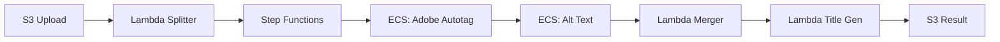
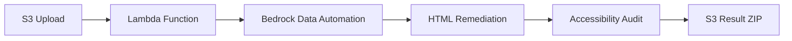

# Introduction to PDF Accessibility Solutions

PDF Accessibility Solutions is an AWS-based infrastructure project that provides automated remediation of PDF documents to meet WCAG 2.1 Level AA accessibility standards. Built by Arizona State University's AI Cloud Innovation Center, this solution leverages AWS services and generative AI to transform inaccessible PDF content into compliant, accessible documents.

## The Accessibility Challenge

Many organizations struggle with PDF accessibility compliance:

- **Manual remediation is expensive** - Document accessibility experts are scarce and remediation is time-intensive
- **Legacy content is inaccessible** - Millions of existing PDFs lack proper structure, alt text, and semantic tags
- **Compliance requirements are strict** - WCAG 2.1 Level AA standards require specific technical implementations
- **Scale is overwhelming** - Organizations may have thousands of documents requiring remediation

This solution automates the remediation process using AWS serverless and container services combined with AI-powered content analysis.

## Two Complementary Solutions

The infrastructure provides two deployment options to address different use cases:

<CardGroup cols={2}>
  <Card title="PDF-to-PDF Remediation" icon="file-pdf" href="/architecture/pdf-to-pdf">
    Maintains the original PDF format while improving accessibility. Best for documents that must remain as PDFs for legal, archival, or workflow reasons.
  </Card>
  <Card title="PDF-to-HTML Remediation" icon="code" href="/architecture/pdf-to-html">
    Converts PDFs to accessible HTML format with preserved layout. Best for web-accessible content and documents that can be reformatted.
  </Card>
</CardGroup>

## Key Features

### Automated Accessibility Improvements

Both solutions automatically implement WCAG 2.1 Level AA compliance features:

- **Semantic Structure** - Proper heading hierarchies, document titles, and structural tags
- **Alternative Text** - AI-generated descriptions for images and figures using Amazon Bedrock
- **Language Detection** - Automatic document language identification using Amazon Comprehend
- **Color Contrast** - Analysis and recommendations for text/background contrast issues
- **Table Markup** - Proper table headers, captions, and relationships
- **Form Labels** - Accessible form field labels and descriptions
- **Reading Order** - Correct logical reading sequence for screen readers

### Scalable AWS Infrastructure

<CardGroup cols={2}>
  <Card title="Serverless Processing" icon="server">
    Lambda functions and Step Functions orchestrate processing workflows with automatic scaling and pay-per-use pricing.
  </Card>
  <Card title="Containerized Tasks" icon="docker">
    ECS Fargate tasks run specialized processing containers for Adobe PDF Services and AI-powered remediation.
  </Card>
  <Card title="Batch Operations" icon="layer-group">
    Upload multiple PDFs for parallel batch processing with consolidated results and monitoring.
  </Card>
  <Card title="Observability" icon="chart-line">
    CloudWatch dashboards provide real-time monitoring of processing status, logs, and performance metrics.
  </Card>
</CardGroup>

## Architecture Overview

The solution uses AWS Cloud Development Kit (CDK) for infrastructure as code:

### PDF-to-PDF Architecture

**Components:**
- **S3 Event Trigger** - Automatically detects uploaded PDFs in the `pdf/` folder
- **PDF Splitter Lambda** - Splits large PDFs into chunks for parallel processing
- **Step Functions Workflow** - Orchestrates the remediation pipeline with error handling
- **ECS Fargate Tasks** - Runs Adobe PDF Services API and Amazon Bedrock for content analysis
- **VPC Endpoints** - Reduces cold start times by 10-15 seconds with private ECR access
- **CloudWatch Dashboard** - Provides file-level status tracking and log aggregation

### PDF-to-HTML Architecture

**Components:**
- **S3 Event Trigger** - Detects uploads to the `uploads/` folder
- **Lambda Container** - Processes PDFs using the Content Accessibility Utility
- **Bedrock Data Automation** - Parses PDF structure and extracts content
- **ECR Repository** - Hosts the Docker image for Lambda container execution
- **HTML Generator** - Creates semantically structured, accessible HTML

<Note>
**Technology Stack:** Python 3.12, Node.js 18, AWS CDK 2.196, Java 21 (PDF merger), Docker containers
</Note>

## What Gets Remediated?

### PDF-to-PDF Output

Remediated PDFs include:
- Embedded accessibility tags and structure
- AI-generated alt text for images
- Proper document title and metadata
- Semantic heading structure
- Language attributes
- Results stored in `result/` folder with "COMPLIANT" prefix

### PDF-to-HTML Output

HTML conversion includes:
- `remediated.html` - Final accessible HTML document
- `result.html` - Original conversion before remediation
- `images/` folder - Extracted images with generated alt text
- `remediation_report.html` - Detailed audit of improvements
- `usage_data.json` - Processing metrics and API usage stats
- Packaged as `final_{filename}.zip` in `remediated/` folder

## Deployment Model

<Steps>
  <Step title="One-Click Deployment">
    Unified deployment script (`deploy.sh`) handles infrastructure provisioning, IAM roles, and service configuration.
  </Step>
  <Step title="Solution Selection">
    Choose PDF-to-PDF, PDF-to-HTML, or both solutions during interactive deployment.
  </Step>
  <Step title="Automated Build">
    CodeBuild projects compile code, build containers, and deploy CDK stacks (3-10 minutes).
  </Step>
  <Step title="Optional UI">
    Deploy a web-based frontend with Cognito authentication for end-user file uploads.
  </Step>
</Steps>

<Tip>
The infrastructure is designed for rapid prototyping and demonstration. For production use, review security best practices and implement additional hardening as needed.
</Tip>

## AWS Services Used

| Service | Purpose |
|---------|--------|
| **S3** | Storage for input PDFs, processing artifacts, and remediated results |
| **Lambda** | Serverless functions for PDF splitting, merging, and title generation |
| **ECS Fargate** | Containerized tasks for Adobe PDF Services and Bedrock processing |
| **Step Functions** | Workflow orchestration with parallel chunk processing |
| **Bedrock** | AI models for alt text generation (Nova Pro) and data automation |
| **ECR** | Container image registry for Lambda and ECS containers |
| **VPC** | Network isolation with public/private subnets and NAT gateway |
| **CloudWatch** | Centralized logging, metrics, and monitoring dashboards |
| **Secrets Manager** | Secure storage for Adobe API credentials |
| **Comprehend** | Language detection for document metadata |
| **CodeBuild** | CI/CD pipeline for automated infrastructure deployment |
| **IAM** | Fine-grained access control with least privilege policies |

## Use Cases

<CardGroup cols={2}>
  <Card title="Higher Education" icon="graduation-cap">
    Universities remediating course materials, research papers, and administrative documents for students with disabilities.
  </Card>
  <Card title="Government Agencies" icon="landmark">
    Public sector organizations ensuring Section 508 and ADA compliance for citizen-facing documents.
  </Card>
  <Card title="Healthcare" icon="hospital">
    Healthcare providers making patient education materials and medical records accessible.
  </Card>
  <Card title="Financial Services" icon="building-columns">
    Banks and financial institutions remediating statements, disclosures, and regulatory documents.
  </Card>
</CardGroup>

## Limitations and Disclaimers

<Warning>
**Important:** This solution is provided "as-is" for informational and demonstration purposes. It includes shortcuts for rapid prototyping such as relaxed authentication and authorization. Not suitable for production environments or critical data without additional security hardening.
</Warning>

### Known Limitations

- **Adobe API Required** - PDF-to-PDF solution requires enterprise Adobe PDF Services contract or trial account
- **Service Quotas** - Default AWS limits may need adjustment for large-scale batch processing
- **Document Size** - Very large PDFs (>100MB) may require increased Lambda timeout and memory
- **Complex Layouts** - Highly complex PDF layouts may require manual review after automated remediation
- **Cost Awareness** - AI model invocations (Bedrock) and container runtime (Fargate) incur usage-based charges

### Prerequisites

- AWS account with appropriate permissions
- AWS CloudShell access (CLI pre-configured)
- For PDF-to-PDF: Adobe PDF Services API credentials
- For PDF-to-HTML: Bedrock Data Automation access (typically enabled by default)

## Getting Started

Ready to deploy? Continue to the [Quickstart Guide](/quickstart) for step-by-step deployment instructions.

For detailed architecture information:
- [PDF-to-PDF Architecture](/architecture/pdf-to-pdf)
- [PDF-to-HTML Architecture](/architecture/pdf-to-html)

## Open Source and Support

**Built by Arizona State University's AI Cloud Innovation Center**  
**Powered by AWS**

This project is open source and available on GitHub. The PDF-to-HTML functionality is adapted from AWS Labs' [Content Accessibility Utility on AWS](https://github.com/awslabs/content-accessibility-utility-on-aws).

For questions or issues:
- **Email:** ai-cic@amazon.com
- **GitHub:** [PDF_Accessibility Repository](https://github.com/ASUCICREPO/PDF_Accessibility)
